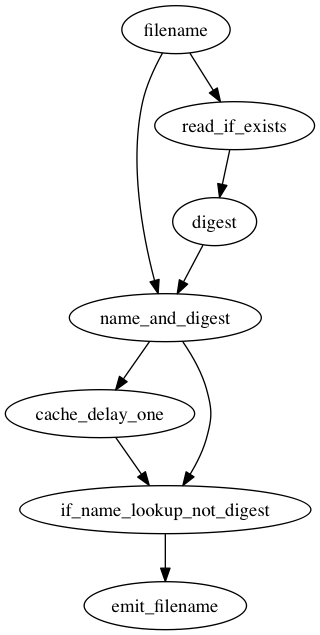

# Uniqhash

Intercept a stream of filenames and output only the ones that have changed.

## Graph

<!--
digraph {
  filename -> name_and_digest;
  filename -> read_if_exists -> digest -> name_and_digest;
  name_and_digest -> cache_delay_one -> if_name_lookup_not_digest;
  name_and_digest -> if_name_lookup_not_digest;
  if_name_lookup_not_digest -> emit_filename;
}
-->

## Usage

    > filename_lister | uniqhash

## Binaries

* [uniqhash-1.1.0.0-MacOSX-10.7.5-11G63b.zip](http://sordina.binaries.s3.amazonaws.com/uniqhash-1.1.0.0-MacOSX-10.7.5-11G63b.zip)

## Other Packages of Interest

* [Dunai](https://github.com/ivanperez-keera/dunai/blob/develop/src/Data/MonadicStreamFunction/Core.hs#L35)
* [Auto](https://hackage.haskell.org/package/auto-0.4.3.0/docs/Control-Auto.html)
* [Varying](https://hackage.haskell.org/package/varying-0.6.0.0/docs/Control-Varying-Core.html)
* [DGSH](https://www.spinellis.gr/sw/dgsh/)
